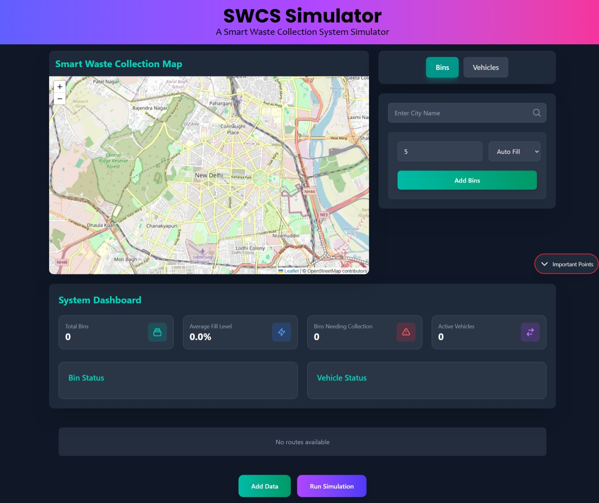

# Smart Waste Management System

A modern web application for optimizing waste collection routes using real-time bin fill levels and vehicle capacity constraints.




## 🌟 Features

- **Interactive Map Interface**
  - Real-time bin placement and monitoring
  - Dynamic route visualization
  - City search functionality
  - Start location selection for vehicles

- **Smart Bin Management**
  - Real-time bin fill level monitoring
  - Automatic bin placement with random fill levels
  - Manual fill level adjustment
  - Visual status indicators for bin conditions

- **Vehicle Route Optimization**
  - Multiple vehicle support
  - Capacity-based route planning
  - Dynamic route generation
  - Visual route representation on map

- **Dashboard Analytics**
  - Total bins overview
  - Average fill level statistics
  - Bins needing collection
  - Active vehicles monitoring

## 🚀 Getting Started

### Prerequisites

- Node.js (v14 or higher)
- npm (v6 or higher)
- Modern web browser

### Installation

1. Clone the repository:
   ```bash
   git clone https://github.com/yourusername/smart-waste-management.git
   cd smart-waste-management/frontend
   ```

2. Install dependencies:
   ```bash
   npm install
   ```

3. Start the development server:
   ```bash
   npm run dev
   ```

4. Open your browser and navigate to `http://localhost:5173`

## 💻 Usage

### Adding Bins
1. Select the "Bins" panel
2. Enter the number of bins to add
3. Choose fill level mode (auto or manual)
4. Click "Add Bins" to place them on the map

### Setting Up Vehicles
1. Select the "Vehicles" panel
2. Enter the number of vehicles
3. Set vehicle capacities
4. Click on the map to set the start location
5. Click "Add Vehicles" to register them

### Running Simulation
1. Click "Add Data" to send current setup to the backend
2. Click "Run Simulation" to generate optimized routes
3. View the generated routes on the map
4. Check route details in the Route Details panel

## 🔧 System Limitations

### Map Interaction
- Refrain from tapping on the map as it will add unnecessary markers
- Map markers cannot be dragged after placement
- Limited to one start location per simulation

### Bin Management
- The number of bins affects simulation performance
- Bin fill level must be between 0-100%
- Bins cannot be deleted once added

### Vehicle Constraints
- The number of vehicles affects simulation performance
- The number of vehicles does not mean the number of routes generated
- Vehicle capacity must be between 100-1000 units
- Start location must be set before adding vehicles

### Route Optimization
- Routes are optimized based on bin fill levels
- Routes cannot be manually modified after generation
- The number of bins in a route affects simulation performance
- Map clicks for start location won't affect route generation

## 🛠️ Tech Stack

- **Frontend**
  - React.js
  - Tailwind CSS
  - Leaflet.js for maps
  - React Hot Toast for notifications

- **Backend**
  - Python
  - FastAPI
  - OR-Tools for route optimization

## 📝 API Documentation

### Endpoints

- `POST /api/optimize/setup`
  - Sends bin and vehicle data for route optimization
  - Body: `{ bins: [], vehicles: [], startLocation: {} }`

- `GET /api/test/build-graph`
  - Retrieves optimized routes
  - Returns: `{ routes: [] }`

- `GET /api/bins/id/{bin_id}`
  - Retrieves specific bin information
  - Returns: `{ id, lat, lng, fill }`

## 🤝 Contributing

1. Fork the repository
2. Create your feature branch (`git checkout -b feature/AmazingFeature`)
3. Commit your changes (`git commit -m 'Add some AmazingFeature'`)
4. Push to the branch (`git push origin feature/AmazingFeature`)
5. Open a Pull Request

## 📄 License

This project is licensed under the MIT License - see the [LICENSE](LICENSE) file for details.

## 👥 Authors

- Pratham Singh - Initial work - [PrathamS1](https://github.com/prathams1)

## 🙏 Acknowledgments

- OpenStreetMap for map data
- OR-Tools for route optimization algorithms
- React and Tailwind CSS communities for their excellent documentation
